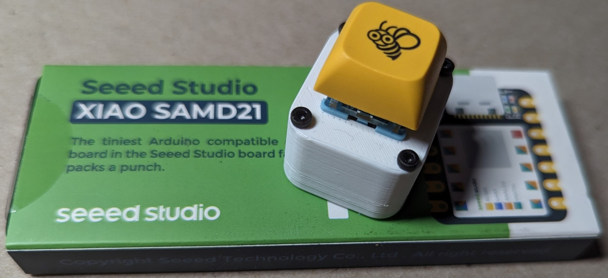
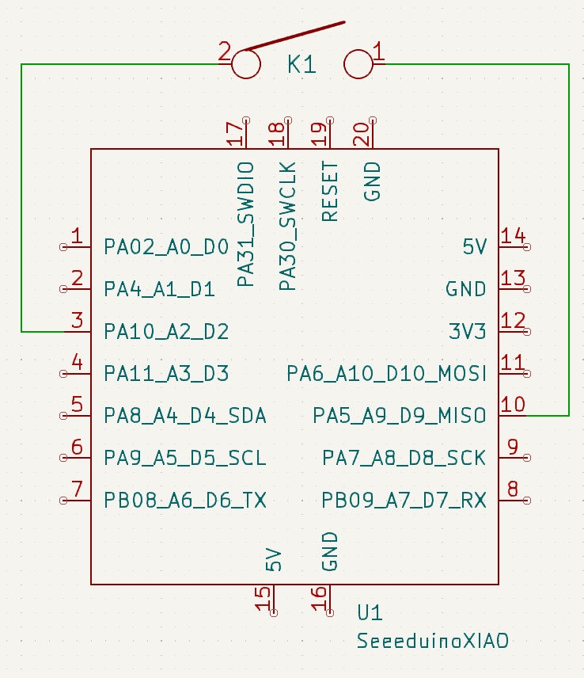
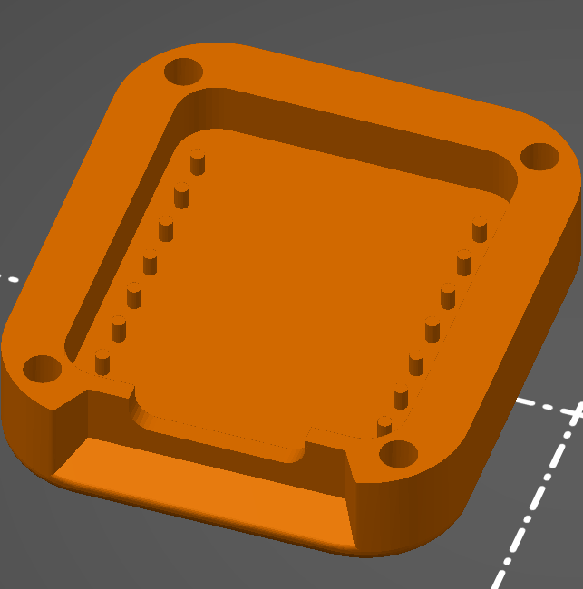
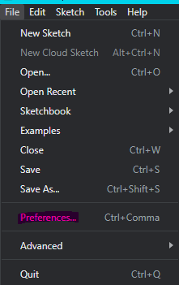
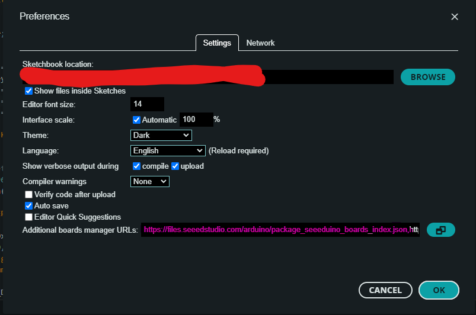
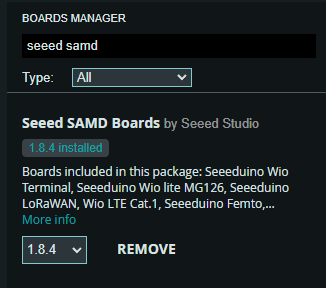

# 1Keyboard
Development of a one key keyboard using the Xiao Seeeduino, an ARM Cortex-M0+ based micro-controller board (which isn't yet supported by QMK)

<!-- TODO: Add some more pictures, no one reads anymore. -->
## Sections
- [1Keyboard](#1keyboard)
  - [Sections](#sections)
  - [Assembly](#assembly)
    - [Wiring](#wiring)
    - [Fastening](#fastening)
  - [Model Design](#model-design)
  - [Programming](#programming)
  - [Remapping](#remapping)
    - [Resources Used](#resources-used)
## Assembly
Fortunately, as this is a keyboard with only one key, the assembly is very simple given that you have the following materials:
1. A somewhat dialed in 3D Printer + your filament of choice
2. 4x M2x16 machine screws
3. 1x Seeed Studio Xiao SAMD21 board.
4. An MX style keyswitch of your choice
5. A keycap compatible with the stem of your chosen keyswitch
6. (Optional) [A 3D printed hotswap socket](https://github.com/stingray127/handwirehotswap) and hot glue 
   1. Use solid core wire instead of a diode

### Wiring
Strip the ends of 2 stranded wires, and solder them to the pins of the keyswitch. Pass the wires through the top of the 1Keyboard body and then push the keyswitch into place. It should be a tight fit.

If you are using a hotswap socket, solder wire onto the pins of the hotswap socket instead and push the keyswitch into place. While the keyswitch is secured, push the hotswap socket onto the pins of the keyswitch and hot glue the socket to the sides of the 1Keyboard body.

Using the disconnected side of the stranded wires, solder the wires to the top side of the Xiao board according to the schematic below. These will leave the wires directly across from each other on the board.

### Fastening
Break off the corresponding tabs in the bottom body of the 1Keyboard

Cut any extruding wire / solder from underneath the Xiao board and push it into the remaining tabs in the bottom body. Join the bodies of the 1Keyboard using pressure from your fingers and begin to screw the M2 screws into the provided holes.

## Model Design

Ordinarily, there would be too much empty space in the top of the 1Keyboard body for the Xiao board to sit flat when connected to the computer. This problem was circumvented by adding some tabs that extended down to the Xiao board.

The tabs push down on the board at the USB-C connected and on top of the MCU enclosure. The prevents any rotation of the board inside of the body.
## Programming
Programming is done in the Arduino IDE.

The following Libraries are required:
- FlashStorage_SAMD.h: For saving the current typed key between power cycles
- Keyboard.h
- Keypad.h

You will need to add an additional board manager to your Arduino IDE:  
Navigate to `File -> Preferences...`

In the Preferences window, paste  
`https://files.seeedstudio.com/arduino/package_seeeduino_boards_index.json`
 
into the Additional boards manager URLs text field. You can add additional managers by adding a comma to the end of another manager URL.

Click OK.

In the Boards Manager tab in the Arduino IDE, search for "Seeed SAMD" and install the board manager from Seeed Studio.

You should now be able to set your 1Keyboard as a Seeeduino Xiao in the Arduino IDE. 

Open [1Keyboard.ino](src/firmware/1Keyboard.ino) in the Arduino IDE.

Click the upload button and the programmer should set the board to bootloader mode before flashing the firmware onto the board.

If all goes well you should now be able to use your 1Keyboard as a fully functioning 1% keyboard!

## Remapping
The 1Keyboard is set to the 'Delete' key by default. If this is undesirable for you, you could always change the keycode in the firmware, but this could be inconvenient for a multitude of reasons (You may have to double short the RST pin to ground which would require you to disassemble the 1Keyboard).

Alternatively, you can download the [Latest KeypadController Release](https://github.com/Brethan/1Keyboard/releases). This will allow you to remap the 1Keyboard to whatever key you'd like as well as a list of special characters.

Please note that this requires [JDK 17 or later](https://www.oracle.com/java/technologies/downloads/#java17) to run.

### Resources Used
[Reference Model For Seeeduino Xiao](https://grabcad.com/library/seeeduino-xiao-2)  
[Reference Model for Cherry MX Switch](https://grabcad.com/library/cherry-mx-switch-5)

---
Copyright (c) 2023 Ethan "steve" Bradley